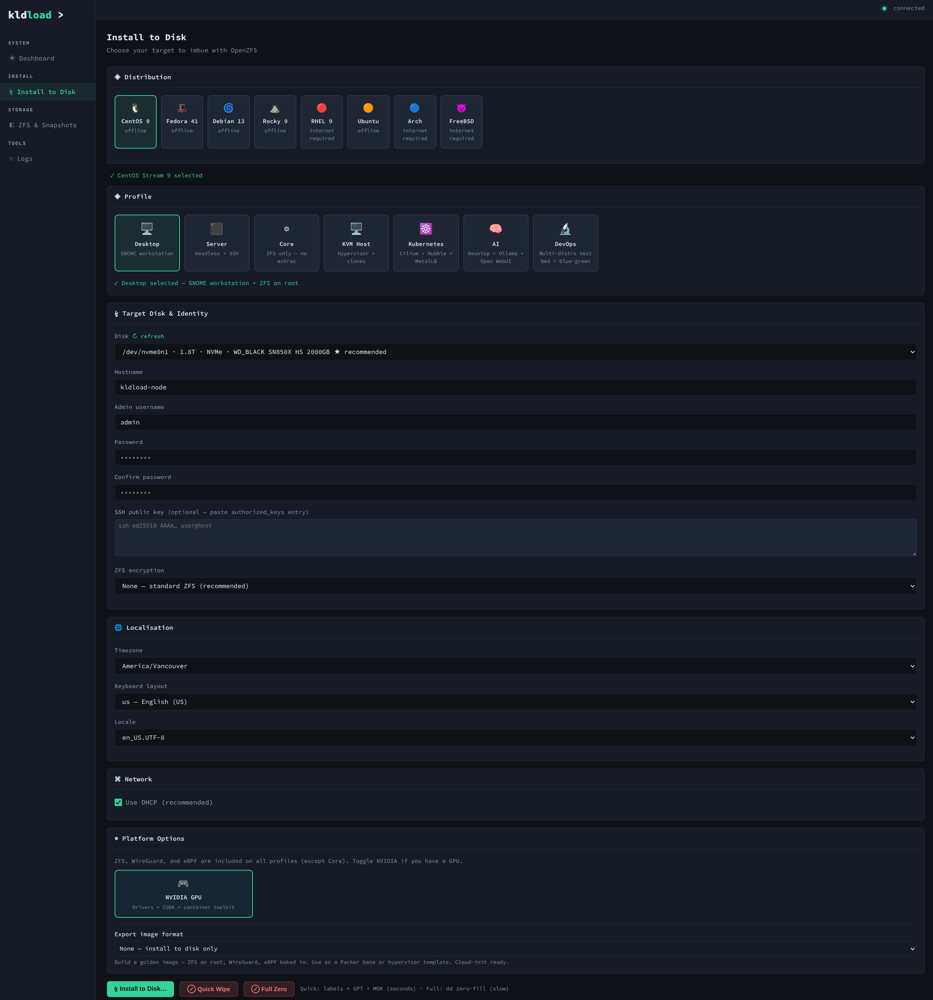
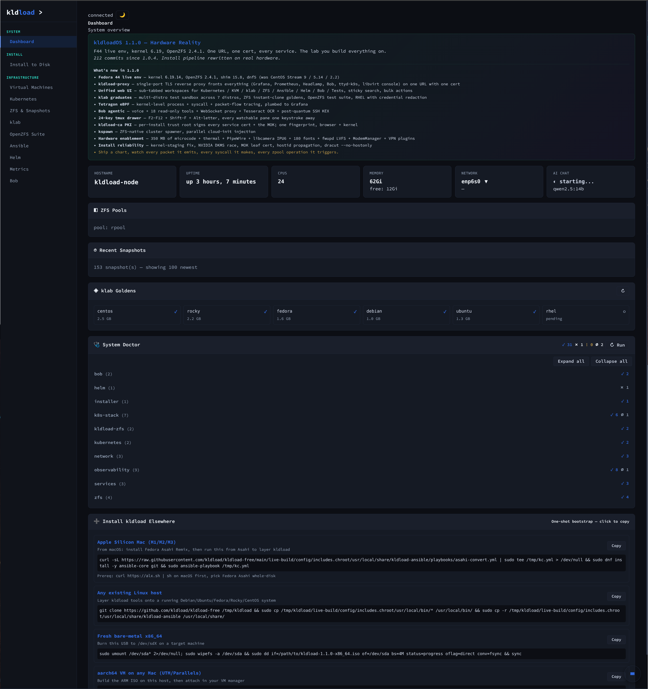

# kldload

**One USB. ZFS on root across any dnf, apt or pacman distribution — plus a GUI-first RHEL workstation, a KVM-on-ZFS hypervisor, Kubernetes, and a local AI assistant, all assembled from stock vendor repos.**

kldload builds a distribution from their own package repos (dnf, apt, pacman, apk) onto **ZFS on root**, with **ZFSBootMenu** boot environments, **WireGuard**, **eBPF**, and an optional **KVM hypervisor**, **Kubernetes**, **klab** multi-distro test platform, and **Ollama + Open WebUI** local AI. Nothing is forked. Nothing is patched. Every package comes straight from the vendor's CDN, and most distros install fully offline from mirrors baked into the ISO.

Pick a distro, pick a profile, install. The profiles are examples of what the substrate can become — start with one, mix in another with `kpkg add`, or build your own from the primitives.

**Website:** [kldload.com](https://kldload.com) &middot; **Download:** [dl.kldload.com](https://dl.kldload.com/kldload-free-latest.iso) &middot; **Discord:** [discord.gg/QX8wf38N3V](https://discord.gg/QX8wf38N3V)

**The family:** **kldload** — the substrate &middot; [zxplore](https://github.com/zxplore/zxplore) — the ZFS console &middot; [wgxplore](https://github.com/wgxplore/wgxplore) — the WireGuard console &middot; [vmxplore](https://github.com/vmxplore/vmxplore) — the VM console

**Installer**



**Dashboard (first boot)**



---

## Quickstart

```bash
# Download and burn (USB target)
curl -L -o kldload.iso https://dl.kldload.com/kldload-free-latest.iso
sudo wipefs -af /dev/sdX
sudo dd if=kldload.iso of=/dev/sdX bs=4M oflag=direct conv=fsync status=progress && sync

# Or build from source
git clone https://github.com/kldload/kldload.git && cd kldload
PROFILE=desktop ./deploy.sh build
sudo ./deploy.sh burn /dev/sdX      # names the device, shows it, asks before writing
```

Boot the USB &rarr; the web UI opens over TLS at `https://<host>:8443` &rarr; pick distro + profile + disk &rarr; install.

---

## Installing with Secure Boot &amp; encryption

Secure Boot and full-disk ZFS encryption both work end-to-end. The full flow:

1. **Download &amp; burn** the ISO to a USB stick (see [Quickstart](#quickstart) above).
2. **Boot the USB.** The installer opens automatically in the browser at
   `https://<host>:8443` &mdash; no login prompt.
3. **Choose** your distribution, profile, and target disk. Encryption is
   **pre-selected (recommended)** &mdash; set your **disk encryption
   passphrase** &mdash; and leave **Secure Boot** enabled (the default), then
   start the install.
4. When it finishes, a Secure-Boot install **powers the machine off** &mdash; so
   *you* control the enrollment boot instead of racing an auto-reboot.
   **Remove the USB stick.**
5. **Power on and enter firmware setup** (usually `Del`, `F2`, or `F10`).
   **Enable Secure Boot**, then save and exit.
6. On the next boot the blue **MokManager** screen appears &mdash; it waits
   **only ~10 seconds, so press any key immediately**, then:
   **Enroll MOK &rarr; Continue &rarr; Yes &rarr; password `kldload` &rarr; Reboot.**
   The password is literally `kldload` &mdash; *not* your admin or encryption
   password.
7. At the **ZFSBootMenu** unlock prompt, enter your **encryption passphrase**
   (TPM2 auto-unlock is on the roadmap — today the passphrase is always asked, which also means disabling Secure Boot never bypasses it).
8. The desktop loads and the console opens at `https://<host>:8443` &mdash; **no
   certificate warning, no login prompt.** Done.

> **Missed the MokManager screen?** Just reboot &mdash; kldload re-offers
> enrollment on every boot until the key is actually enrolled. No reinstall.
> If you end up at a **"Secure Boot validation failed"** screen instead, the
> app grid's **Secure Boot Repair** tool (or `sudo kldload-mok-repair` from
> any terminal &mdash; including the live USB) diagnoses and queues the fix
> in one step.

---

## Troubleshooting

> Full install walkthrough, including what each Secure Boot failure looks
> like and how to decide whether to run with it on at all:
> **[docs/INSTALL.md](docs/INSTALL.md)**.

### Secure Boot / MOK

| Symptom | Fix |
|---|---|
| Missed the blue MokManager screen | Reboot &mdash; enrollment is re-offered automatically. Or `sudo kldload-mok-repair repair`, then reboot. |
| "Secure Boot validation failed" / "Verification failed" at boot | The install's MOK isn't enrolled. Run **`sudo kldload-mok-repair`** (installed system or live USB) &mdash; it shows whether the boot chain's key is enrolled and `repair` queues the fix; then reboot, **press a key at the 10-second blue screen**, Reset &rarr; Enroll, password `kldload`. Or temporarily disable Secure Boot in firmware to boot and repair from the OS. |
| Reinstalled several times / MOK operations start failing | Stale keys accumulate in NVRAM (one per install). `sudo kldload-mok-repair repair` queues a **Reset MOK list** + enrollment of the current key in one pass. |
| Check enrollment / signing state | `sudo kldload-mok-repair` (or `kldload-mok-repair status`, `mokutil --list-enrolled`). |
| NVIDIA or ZFS module won't load under SB | Same cause &mdash; enroll the MOK. `sudo kldload-mok-repair status` shows the module signer. |
| Forgot the MOK password | It's `kldload` (set a different one at install with `KLDLOAD_MOK_PASSWORD`). |
| **Boots to emergency mode** after skipping enrollment | The MOK is not enrolled, so the kernel refuses the DKMS-signed ZFS module and non-root datasets never mount. Confirm with `modprobe zfs` &mdash; **`Key was rejected by service`** is conclusive. Fix: `sudo kldload-mok-repair repair` then reboot and enroll, **or** disable Secure Boot in firmware if this is a lab box. Note this can appear weeks later, at the first kernel update after the missed prompt. |
| Boots fine with SB off, fails with SB on (installed before 1.4.0-rc3) | Older builds re-signed the staged kernel with the per-install MOK key, discarding the distro's own signature. Restore it: `sudo cp /boot/vmlinuz-$(uname -r) /boot/efi/EFI/BOOT/vmlinuz` then enable Secure Boot. Fixed at install time from 1.4.0-rc3 on. |

### Console certificate warning

Shouldn't happen on a fresh install &mdash; the console cert is issued by the
kldload CA, which is trusted in the browser automatically. If a warning appears,
re-import the CA root (clearing any stale entry first):

```bash
kldload-trust-cert                                              # re-import the CA root
# stubborn? drop stale entries first, then re-import:
certutil -d sql:"$HOME/.pki/nssdb" -D -n kldload-webui 2>/dev/null
certutil -d sql:"$HOME/.pki/nssdb" -D -n kldload-ca     2>/dev/null
kldload-trust-cert
```

### Console asks for a password

Only **remote** browsers do &mdash; sign in with your admin account (a `wheel`/
`sudo` user). On the machine itself the console never prompts.

---

## Five in the menu, three package managers underneath

| Distribution | Install method | Offline |
|---|---|---|
| Fedora 44 | `dnf --installroot` | Yes (RPM darksite) |
| Debian 13 (Trixie) | `debootstrap` | Yes (APT darksite) |
| RHEL 10 | `dnf --installroot` | No (Red Hat CDN; subscription required) |
| Arch Linux | `pacstrap` | No (rolling; requires internet) |
| FreeBSD | base sets | No (requires internet) |

Those five are what the installer offers, because they are the five that get
tested. The *method* underneath is not distro-specific: kldload installs by
calling `dnf --installroot`, `debootstrap` or `pacstrap` against a distribution's
own repositories. Nothing is forked, nothing is patched, and no image is
pre-baked for a given distro.

Which means the supported set is really "distributions whose packages come from
dnf, apt or pacman" — CentOS Stream, Rocky and Ubuntu are all still installable
today with `KLDLOAD_DISTRO=<name>`; they are simply not on the menu, because a
menu of everything is a menu nobody can use. Adding a distribution in one of
those families is repository configuration, not new machinery.

The honest bound: a new distribution needs its repos and keys declared, and its
kernel paired with a version of OpenZFS that builds against it. That is a
morning's work, not a port.

Live environment is **Fedora 44** (kernel 7.0.x — currently `7.0.12` — with OpenZFS `2.4.3` on root).

> **Fedora 44 + ZFS:** OpenZFS now ships a native `fc44` build (`2.4.3`) that builds against Fedora 44's stock 7.0 kernel, so there is no `fc43` bridge and no kernel pin — the live ISO and the installed target ride the GA kernel. The shipped kernel + OpenZFS + NVIDIA are **versionlocked at first boot**, so a routine `dnf update` can't pull a kernel ZFS can't build for. (OpenZFS 2.4.x caps at kernel ≤ 7.0.x; the substrate only moves to a newer kernel once a matching ZFS build exists.)

---

## Workstation edition (1.3.1)

The **Desktop** profile is a GUI-first RHEL 10 workstation: expert operations — ZFS replication, KVM, Kubernetes, eBPF observability — exposed as point-and-shoot desktop apps, not CLI rituals.

- **Install-time Platform Options.** Checkboxes for NVIDIA drivers, KVM, Kubernetes, eBPF tooling, and golden-image building. Desktop-only, default-clean — you opt into the heavy stuff.
- **Native app windows.** Each tool (VMs, Kubernetes, ZFS, Metrics, the model, …) opens as its own chromeless GTK/WebKit window — no browser chrome, no left menu — backed by the same web console the server edition serves.
- **Console as its own app.** The tmux F-key operator cockpit (k9s, ZFS internals, eBPF panels, VM/log streams) is a single Console application — not embedded inside every tool window.
- **Local model.** Ollama with Open WebUI (plus RAG and voice) as a desktop app. No cloud, no telemetry.

---

## Profiles &mdash; examples, not the menu

| Profile | What gets assembled on first boot |
|---|---|
| **Desktop** | GNOME + ZFS root + Firefox + GPU drivers + Ollama + full `k*` tool suite + native app windows + the Console cockpit + offline darksites |
| **Server** | Headless SSH + ZFS root + full `k*` tools + sanoid + WireGuard + eBPF + offline darksites |
| **KVM Host** | libvirt + qemu-kvm + virtio, every VM on a ZFS zvol, `~100`&nbsp;ms COW clones, atomic snapshots, `zfs send` replication |
| **AI** | KVM Host + Ollama + Open WebUI + RAG on the local GPU |
| **klab** | KVM Host + golden VMs per supported distro, blue/green via ZFS instant clone, fault injection, Distro Matrix Runner, live Hubble traffic map |
| **OpenZFS Suite** | KVM Host + dedicated test goldens wired into `ztest`/`zloop` for upstream OpenZFS regression hunting |
| **Core** | ZFS on root only. Stock distro. No `k*` tools, no web UI, no darksites. ~200 MB beyond the vendor's base install |

```bash
kube-cluster up           # single- or three-node K8s in < 20 minutes
kube-demo                 # PetClinic + ArgoCD smoke test
klab golden centos        # build the CentOS golden VM
klab matrix run script.sh # run a change against every supported distro in parallel
```

---

## What's wired into the image

- **OpenZFS on root** — checksummed, compressed, snapshotted, self-healing on mirrors. lz4 default. Native AES-256-GCM encryption recommended and pre-selected in the installer (TPM2 auto-unlock when the hardware has it, passphrase at boot otherwise); dedup optional.
- **ZFSBootMenu** — UEFI bootloader that understands ZFS. Boot environments. Seconds-fast rollback. No GRUB.
- **WireGuard** — kernel-level encrypted networking. One UDP port at the firewall.
- **eBPF observability** — BCC tools + bpftrace + an F-key tmux cockpit on the host; Cilium + Hubble + Tetragon inside the K8s profile (no kube-proxy, no iptables, no sidecars).
- **KVM hypervisor** — libvirt + qemu-kvm with every VM on a ZFS zvol. `~100`&nbsp;ms clones via COW. Atomic snapshots. fs-freeze app-consistency. Incremental `zfs send` replication.
- **NVIDIA + CUDA** — drivers and CUDA optional at install. Time-sliced GPU sharing across the model and guest VMs. No PCIe passthrough required.
- **Ollama + Open WebUI** — local model: RAG over the codebase + voice + tmux awareness + ReAct agent loop + eBPF-aware tool registry. No cloud, no telemetry.
- **Observability** — Prometheus + Grafana + Loki + Alertmanager, Go + bash exporters, pre-wired dashboards, `zed` ZFS events bridged to Loki.
- **Secure Boot + MOK** — per-machine key generation, automatic module signing, DKMS auto-sign on kernel upgrades. Off by default.
- **Image export** — `kexport` produces qcow2 / VMDK / VHD / OVA / raw, auto-sealed with cloud-init multi-datasource config. Ready for Packer or direct hypervisor import.
- **Offline + Air-gap** — RPM and APT mirrors baked in. The USB is the deployment, the recovery, and the air gap.

---

## What's inside &mdash; the open source it's made of

kldload invents almost nothing. It is an opinionated **assembly** of software you
already know, installed from the vendors' own repos and wired together so the
pieces actually meet. If you recognise a name below, that is the point &mdash;
you already know how to operate it, and nothing here is a bespoke
reimplementation you would have to learn.

**Nothing is forked and nothing is patched.** The tree carries **zero `.patch`
files and zero vendored third-party source**; every component arrives from its
upstream package repo, its official release artifact, or its own git remote.

Two shipped components are **not** open source, and it would be dishonest to
bury them in a list like this: **Google Chrome** (the default desktop browser
and the renderer for the kldload GUI apps &mdash; its open-source upstream
Chromium is what Debian targets get) and the **NVIDIA driver + CUDA**, which is
opt-in at install. Everything else below is open source under its own licence.

### Storage &amp; boot
| Project | What it does here |
|---|---|
| [OpenZFS](https://openzfs.org) | root filesystem, snapshots, clones, `send`/`recv`, native encryption |
| [ZFSBootMenu](https://zfsbootmenu.org) (2.3.0) | UEFI boot environments, rollback from the boot screen |
| [sanoid / syncoid](https://github.com/jimsalterjrs/sanoid) | snapshot retention policy and replication |
| dracut, GRUB2, shim, mokutil, sbsigntools, pesign | initramfs, UEFI boot chain, Secure Boot module signing |
| cryptsetup, LVM2, mdadm, e2fsprogs, xfsprogs, btrfs-progs | non-ZFS storage the installer must still read |

### Virtualization
| Project | What it does here |
|---|---|
| [libvirt](https://libvirt.org) + [QEMU/KVM](https://www.qemu.org) | every VM, each backed by its own ZFS zvol |
| `virt-install`, `qemu-img`, qemu-guest-agent | provisioning, image conversion, in-guest control |
| [swtpm](https://github.com/stefanberger/swtpm) + [edk2/OVMF](https://github.com/tianocore/edk2) | emulated TPM 2.0 and UEFI firmware for guests |
| [cloud-init](https://cloud-init.io) | first-boot configuration of golden-image clones |

### Kubernetes &amp; networking
| Project | What it does here |
|---|---|
| [Kubernetes](https://kubernetes.io) 1.32 (kubeadm/kubelet/kubectl) | the cluster itself |
| [containerd](https://containerd.io) | container runtime |
| [Cilium](https://cilium.io) 1.16.5 + [Hubble](https://github.com/cilium/hubble) | eBPF CNI, kube-proxy replacement, flow visibility |
| [MetalLB](https://metallb.io) 0.14.9 | bare-metal `LoadBalancer` services |
| [kube-vip](https://kube-vip.io) 0.8.9 | control-plane VIP for HA |
| [OpenEBS ZFS LocalPV](https://github.com/openebs/zfs-localpv) | CSI storage on ZFS |
| [local-path-provisioner](https://github.com/rancher/local-path-provisioner) (Rancher) | fallback StorageClass where a node has no ZFS |
| [Gateway API](https://gateway-api.sigs.k8s.io) 1.2.1, [metrics-server](https://github.com/kubernetes-sigs/metrics-server) | ingress API, resource metrics |
| [Helm](https://helm.sh), [k9s](https://k9scli.io), [Headlamp](https://headlamp.dev) | chart installs, terminal cluster UI, web cluster UI |
| [WireGuard](https://www.wireguard.com), nftables, NetworkManager, chrony | encrypted backplane, firewall, networking, time |
| [nginx](https://nginx.org) | one TLS reverse proxy on `:8443` for every browser-facing service |

### Observability
| Project | What it does here |
|---|---|
| [Prometheus](https://prometheus.io) + [Alertmanager](https://github.com/prometheus/alertmanager) | metrics and alerting |
| [Grafana](https://grafana.com) | pre-wired dashboards |
| [Loki](https://grafana.com/oss/loki/) + Promtail | log aggregation, with ZFS `zed` events bridged in |
| node&#95;exporter, [ebpf&#95;exporter](https://github.com/cloudflare/ebpf_exporter), process-exporter, smartctl&#95;exporter, zfs&#95;exporter, libvirt-exporter | the metric sources |

### eBPF &amp; security
| Project | What it does here |
|---|---|
| [BCC tools](https://github.com/iovisor/bcc) + [bpftrace](https://bpftrace.org) | the F-key tracing cockpit (execsnoop, biosnoop, tcplife, …) |
| [Tetragon](https://tetragon.io) | runtime security observability |
| Secure Boot + MOK toolchain | per-machine keys, DKMS auto-signing on kernel upgrade |

### Desktop
| Project | What it does here |
|---|---|
| [GNOME](https://www.gnome.org) &mdash; Shell, GDM, Nautilus, Terminal/[Ptyxis](https://gitlab.gnome.org/chergert/ptyxis), Control Center | the workstation session (LightDM on Debian Trixie) |
| [PipeWire](https://pipewire.org) + WirePlumber | audio |
| [Google Chrome](https://www.google.com/chrome/) | the default browser on RPM desktops, from Google's own repo, and what the kldload GUI apps render in |
| [Firefox](https://www.mozilla.org/firefox/) | also installed on RPM desktops, and the browser on the GhostBSD posture |
| [Chromium](https://www.chromium.org) / [Epiphany](https://apps.gnome.org/Epiphany/) | the browser on Debian / Ubuntu targets respectively |
| [NVIDIA driver + CUDA](https://www.nvidia.com) | optional at install, via RPM Fusion `akmod-nvidia` |
| [Steam](https://store.steampowered.com) | optional, via [Flathub](https://flathub.org) (Fedora) |
| [eza](https://eza.rocks), [bat](https://github.com/sharkdp/bat), [fd](https://github.com/sharkdp/fd), [ripgrep](https://github.com/BurntSushi/ripgrep), [zoxide](https://github.com/ajeetdsouza/zoxide), [fzf](https://github.com/junegunn/fzf), [fastfetch](https://github.com/fastfetch-cli/fastfetch), htop | the modern CLI set, pre-wired into the shell |
| [ttyd](https://github.com/tsl0922/ttyd) + [tmux](https://github.com/tmux/tmux) | browser terminal, and the session everything attaches to |

### AI &mdash; Ollama and Open WebUI, entirely local
| Project | What it does here |
|---|---|
| [Ollama](https://ollama.com) | the LLM runtime |
| [Llama 3.1 / 3.2](https://www.llama.com) &amp; [Qwen2.5](https://github.com/QwenLM/Qwen2.5) | the models, chosen automatically by detected VRAM (incl. Llama 3.2-Vision, Qwen2.5-Coder) |
| [ChromaDB](https://www.trychroma.com) + `nomic-embed-text` | the RAG vector store and embeddings over your own docs |
| [whisper.cpp](https://github.com/ggerganov/whisper.cpp) | speech to text (voice input) |
| [Piper](https://github.com/rhasspy/piper) | text to speech (voice output) |

No cloud, no telemetry, no API key &mdash; the models and the index live on the machine.

### Automation
| Project | What it does here |
|---|---|
| [Ansible](https://www.ansible.com) (ansible-core) | golden-VM provisioning and the web UI's Ansible tab |
| [Argo CD](https://argo-cd.readthedocs.io) | GitOps engine behind the demo app stack |
| [osbuild-composer](https://www.osbuild.org) | Red Hat's own toolchain, used to build the RHEL golden image |

### Rescue toolkit (on the live USB)
[GParted](https://gparted.org), [TestDisk/PhotoRec](https://www.cgsecurity.org), `ddrescue`,
[fsarchiver](https://www.fsarchiver.org), smartmontools, nvme-cli, `p7zip`,
ntfs-3g/exfatprogs, `fio`, `stress-ng`, memtest86+ &mdash; the install USB doubles
as the recovery USB.

### How a distro gets built
The installer bootstraps each target with **that distro's own tool** &mdash;
[debootstrap](https://wiki.debian.org/Debootstrap) (Debian/Ubuntu),
`dnf --installroot` (Fedora/CentOS Stream/Rocky/RHEL),
and [pacman](https://archlinux.org/pacman/) (Arch, via `pacman-static`).
Packages come from the vendors' own
CDNs; the ISO itself is built with Red Hat's
[lorax](https://github.com/weldr/lorax), `dracut`, `squashfs-tools` and
[xorriso](https://www.gnu.org/software/xorriso/) inside a Fedora 44 container.

### The sister consoles
[zxplore](https://github.com/zxplore/zxplore) (ZFS) is a separate BSD-3 project
by the same author, built from its own upstream repo at ISO-build time; the
exact commit shipped is recorded in `/etc/kldload/zxplore-commit`. It runs on
any Linux/BSD box &mdash; kldload is its first-party distribution, not its owner.

[vmxplore](https://github.com/vmxplore/vmxplore) (KVM) is the same arrangement:
its own repo, its own release cadence, shipped here.

**wg** (WireGuard) is built from this repository's own `wg/` directory, so
`/etc/kldload/wgxplore-commit` records kldload's HEAD rather than a separate
upstream. It was folded in on 2026-08-10 as a read-only estate lens.

> Licences are each project's own; kldload ships them unmodified and adds no
> licence terms of its own to them. See [License](#license) for kldload's.

---

## CLI tools

### Host
| Command | What it does |
|---|---|
| `kldload-overview` | Unified host status — ZFS, VMs, K8s, GPU, eBPF, services |
| `kst` | System health dashboard |
| `kldload-console` | tmux F-key cockpit with live eBPF panels |

### ZFS
| Command | What it does |
|---|---|
| `ksnap` | Snapshot manager |
| `kclone` | Clone datasets / zvols |
| `kbe` | Boot environment manager |
| `kdf` | ZFS-aware disk usage |
| `kpkg` | Package manager with pre-install snapshots |
| `kupgrade` | Safe upgrade with automatic rollback |
| `krecovery` | Disaster recovery |
| `kexport` | Export golden images (qcow2 / VMDK / VHD / OVA / raw) |

### KVM
| Command | What it does |
|---|---|
| `kvm-create` | Create VM on a ZFS zvol |
| `kvm-clone` | ZFS instant clone (`~100`&nbsp;ms) |
| `kvm-snap` | Snapshot a VM |
| `kvm-list` | List all VMs |
| `kvm-delete` | Destroy VM + zvol |

### Kubernetes
| Command | What it does |
|---|---|
| `kube-cluster up` | Bring up a single- or three-node K8s cluster |
| `kube-cluster destroy` | Tear it down (golden preserved) |
| `kube-demo` | Deploy PetClinic + ArgoCD smoke test |
| `kube-smoke-test` | Automated cluster verification |

### klab
| Command | What it does |
|---|---|
| `klab golden <distro>` | Build / refresh a golden VM image |
| `klab matrix run` | Run a script against every supported distro in parallel |
| `klab-vm-debug-bundle` | Auto-fires on test failure — OpenZFS-ready debug tarball |

---

## deploy.sh

| Subcommand | What it does |
|---|---|
| `build` | Build the ISO (uses cached darksites) |
| `full` | Rebuild the builder image + all darksites, then build the ISO |
| `clean` | Remove build artifacts |
| `burn [/dev/sdX] [--yes]` | Write the ISO to a USB device. Names the target; falls back to `USB_DEVICE`, then auto-detects a single removable drive. Confirms interactively (prints the device's model and size, and asks you to type the name back); `--yes` skips the prompt for scripts. |
| `builder-image` | Rebuild the Fedora 44 builder container |
| `smoke-build` | Static checks on the built ISO (size, freshness, content) |
| `zfs-pin` | Derive the kernel pin from the newest OpenZFS release's declared `Linux-Maximum` and report drift against `build-iso.sh` (`--check` for CI, `--json` for scripts) |
| `smoke-test <distro> <profile>` | Full install lifecycle in KVM, then smoke-test the installed target |
| `build-debian-darksite` | Build / refresh the Debian APT offline mirror |
| `build-ubuntu-darksite` | Ubuntu mirror &mdash; retired 2026-08, opt in with `KLDLOAD_INCLUDE_UBUNTU_DARKSITE=1` |
| `build-fedora-darksite` | Build / refresh the RPM offline mirror |
| `build-ollama-darksite` | Cache the Bob/Ollama model bundle |
| `kvm-deploy` / `kvm-deploy-bob` | Deploy the ISO to local KVM via virt-install |
| `proxmox-deploy` | Deploy to a remote Proxmox host via the `qm` API |
| `deploy-all` | Build + deploy across the configured targets |

---

## Architecture

```
Live environment:  Fedora 44 (kernel 7.0.x, OpenZFS 2.4.3)
Builder:           Fedora 44 container (lorax + squashfs-tools + xorriso + dracut)
Bootstrap paths:   dnf --installroot  (CentOS / Fedora / Rocky / RHEL)
                   debootstrap        (Debian / Ubuntu)
                   pacstrap           (Arch)

Installer:         Python web UI + ~10 bash libraries (lib/) + backend/bin tools
Web UI:            single HTML file per edition + WebSocket install-log stream
Single-port TLS:   kldload-proxy fronts the web UI, Grafana, Prometheus, Headlamp,
                   Bob, k9s/ttyd, and the libvirt console on one URL (:8443) with one cert
```

The user picks the target distro at install time. After install the system runs upstream packages from the vendor's public repos. There is no kldload package repository and no kldload-specific runtime updates — `dnf update` / `apt upgrade` / `pacman -Syu` just work.

---

## Releases

### 1.4.0-rc2 &mdash; The ZFS Console (release candidate)

The workstation gains a real ZFS control surface and a friction-free web
console. This collapses the 1.3.2&ndash;1.3.6 development work &mdash; never
cut as separate point releases &mdash; into one release.

**Secure Boot + full-disk ZFS encryption both work end-to-end** &mdash; validated
on hardware: the installer powers off after install, you enable Secure Boot and
enroll the MOK (password `kldload`), unlock with your passphrase, and boot into a
clean, signed, encrypted system. See
[Installing with Secure Boot &amp; encryption](#installing-with-secure-boot--encryption).

**[zxplore](https://github.com/zxplore/zxplore) &mdash; the universal ZFS console (new)**
- A native desktop app for the whole ZFS lifecycle: browse datasets, a live
  4-column dossier, snapshot / clone / rollback, replicate (local&harr;remote
  and server-to-server), boot environments, encryption keys, pool scrub / trim,
  inline property editing &mdash; right-click on any dataset.
- Built-in server manager (WinSCP-style saved connections, key-first auth,
  paste/generate keys, proxy jump hosts) with dual connectable panes for
  remote-to-remote replication.
- Runs on **any** Linux/BSD box with ZFS &mdash; an independent open project at
  [github.com/zxplore/zxplore](https://github.com/zxplore/zxplore). On kldload
  it auto-detects the `k`-commands and lights up extra tools. Replaces the older
  bundled ZFS utilities. `zxplore --tui` for headless/SSH.

**[wgxplore](https://github.com/wgxplore/wgxplore) &mdash; the WireGuard networks console (new)**
- The same console, one domain over: every host, interface and peer in one
  tree, read live from the kernel over plain SSH &mdash; so the encrypted
  backplane under your VMs and Kubernetes nodes is something you can *see*.
- Declares networks as small files, renders them to plain WireGuard configs,
  and flags any peer that is running but was never declared.
- Independent and universal like its sibling: it manages estates it did not
  create, and any device that speaks WireGuard can join one it did. Baked into
  every kldload profile; `wgx` on every install, GUI where there's a screen.

**Console &amp; access**
- **Zero-prompt on-box console.** The web console (`:8443`) authenticates you
  automatically when you're at the machine (loopback trust over a proxy-only
  socket) &mdash; no token, no password, ever, for local use.
- **Remote access = your system password** (PAM, wheel/sudo), kept in memory for
  the session only. A scriptable bearer token remains for automation.
- **The live installer opens straight into the installer** &mdash; no credential
  needed to run an install.
- **No certificate warning** &mdash; the kldload CA root is trusted in the
  browser on first paint and stays trusted across cert rotation.

**Boot &amp; install reliability**
- **Offline-resilient first boot** &mdash; a flaky or absent network download no
  longer aborts firstboot; the box still comes up fully configured.
- **Secure Boot is forgiving** &mdash; Secure-Boot installs power off so you
  control the MOK-enrollment boot, and a healing net re-offers the blue
  MokManager prompt every boot until the key is actually enrolled (no more
  one-shot dead end).
- Boot fixes: the libvirt default network self-heals offline, the TLS cert stops
  churning against the cluster mesh, and NVIDIA VRAM is re-checked before the AI
  assistant is skipped.
- Installer safety: the boot USB is excluded from wipe targets, a failed
  disk-wipe aborts instead of silently continuing, and the encrypted-passphrase
  install is boot-verified.
- Observability dashboards no longer paint healthy metrics red.

#### What makes kldload different
- **Reproducible, air-gapped substrate** &mdash; every artifact (RPMs, binaries,
  container images, models) is packed at build time; install and first boot run
  fully offline (darksite).
- **One image, many substrates** &mdash; RHEL / Rocky / CentOS Stream / Fedora /
  Debian / Ubuntu / Arch, picked at install; upstream packages thereafter.
- **ZFS-native** &mdash; boot environments, snapshots, and replication are
  first-class; [zxplore](https://github.com/zxplore/zxplore) is the desktop face.
- **One click to a cluster** &mdash; a KVM host, a real multi-node Kubernetes
  cluster, and a full observability plane (Prometheus / Grafana / Cilium+Hubble /
  Tetragon) stand up on first boot.
- **Looks like stock RHEL, on purpose** &mdash; the whole expert toolbox sits one
  click behind familiar chrome.
- **Encrypted by default** &mdash; per-dataset encryption unlocked by USB keyfile
  &rarr; TPM &rarr; passphrase, on a Secure-Boot signed chain.

### 1.3.1 &mdash; The Kernel-Loaded Desktop
- **CentOS Stream + Rocky moved to EL10** (kernel 6.12, OpenZFS 2.3) to match RHEL 10 &mdash; retires the EL9 (5.14) path that wedged dracut/NVIDIA on first boot
- Per-tool **native-app dashboards** (each web tool opens as its own dock-iconed window) and **VM restore-on-reboot** (running VMs return after a reboot; stopped stay stopped)
- Live env corrected to Fedora 44 **kernel 7.0.12 / OpenZFS 2.4.3** (the old 6.19 pin is gone; ZFS 2.4.3 builds against the GA 7.0 kernel)
- Substrate (kernel + OpenZFS + NVIDIA) **versionlocked at first boot** so `dnf update` can't brick ZFS boot
- KVM / Kubernetes / lab profiles now warn they need hardware virtualization (VT-x / AMD-V or nested virt)

### 1.3.0 &mdash; Workstation+
The Full Stack Automation work-in-progress that was tagged 1.2.0 internally
was never released as a separate version &mdash; it shipped as part of 1.3.0
alongside the Workstation polish. "+" is the hotrod mark on the default
wallpaper: same RHEL 10 desktop image, steel-blue tint, faint &lsquo;+&rsquo;
in the lower-right corner saying *this isn't stock*.

**Workstation (the GUI layer):**
- GUI-first RHEL 10 workstation: expert ops (ZFS / KVM / K8s / eBPF) as point-and-shoot desktop apps
- Install-time **Platform Options** &mdash; NVIDIA / KVM / Kubernetes / eBPF / golden-image building, desktop-only, default-clean
- Native per-tool app windows (chromeless GTK/WebKit), NVIDIA + Wayland render fixes (GSK_RENDERER=ngl pre-baked; firstboot also reloads running user sessions so the fix lands without a re-login &mdash; no first-session Nautilus segfault)
- Console (tmux cockpit) promoted to its own application, de-duplicated from every tool window
- VM serial console embedded in the web UI via the same ttyd-k9s session
- RHEL 10 desktop package + TLS fixes (ptyxis, zenity, glib-networking)
- Steam (Flathub) + nvidia-settings + gvim as default workstation apps
- Refined icon set: per-family colour with one warm accent per glyph, hotrodded RHEL 10 wallpaper, dock pinned to Files / Firefox / Konsole on installed systems (empty on the live ISO so the installer is the focus)

**Full Stack Automation (the install-time layer):**
- PetClinic Microservices + ArgoCD wired into autodeploy
- sanoid / syncoid on by default with sensible policies
- Web UI Demo Mode with deploy / disaster / recover buttons
- State & reconciliation layer under `/var/lib/kldload/state/`
- Deterministic install ordering (CP &rarr; workers &rarr; Cilium &rarr; observability &rarr; Tetragon &rarr; klab)
- Installer auto-generates + bakes an admin SSH key into every install &mdash; nodes are peer-reachable out of the box

### 1.1.0 &mdash; Hardware Reality
- Live env cut over from CentOS Stream 9 to Fedora 44 (kernel 6.19, OpenZFS 2.4.x)
- Single-port TLS reverse proxy fronting every internal service
- Tetragon wired through to Grafana panels
- klab graduated to a first-class profile with per-distro goldens
- Install path rewritten end-to-end against real hardware

### 1.0.x &mdash; Foundations
ZFS on root + ZFSBootMenu, the offline RPM/APT darksites, KVM-on-ZFS with instant zvol clones, `kube-cluster` (K8s on ZFS-backed VMs with Cilium/Hubble/Tetragon), the Bob agent, the observability stack, and the growth from 4 to all seven distributions.

---

## License

BSD-3-Clause. See [LICENSE](LICENSE).
